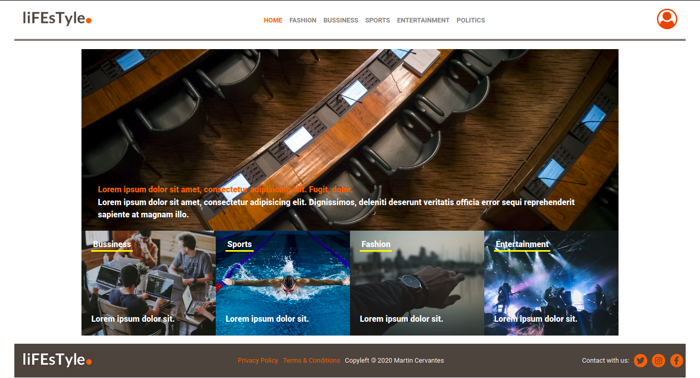

# Lifestyle Articles




## :package: Built With

- Ruby
- Ruby on rails


## :mag: Live Demo

[Live Demo Link](https://lifestyle-articles-project.herokuapp.com/)

## :computer: Getting Started

To get a local copy up and running follow these simple steps.

### Download

1) Clone the repository to your local machine

```sh
  $ git clone https://github.com/mcervantes71/Lifestyle_Articles.git
```

2) cd into the directory

```sh
  $ cd Lifestyle_Articles
```

### Setup

Install gems with:

```sh
  $ bundle install
```

Setup database with:

```sh
  $ rails db:migrate
```

### Usage

run localhost server:

```sh
  $ rails server
```

if presented with and `Error` message similar to this:


Run:

```sh
  $ yarn install --check-files
```

### Testing
[Pre-requisite] 
``` sh
  $ gem install rspec
```

1) cd into the directory

```sh
  $ cd Lifestyle_Articles
```

2) Load the testing module

```sh
  $ rspec
```

## :busts_in_silhouette: Author

👤 **Martin Cervantes**

- Linkedin: [Martin Cervantes](https://www.linkedin.com/in/cervantesmartin/)
- Twitter: [@M4rt1nC3rv4nt3s](https://twitter.com/M4rt1nC3rv4nt3s)
- Github: [@mcervantes71](https://github.com/mcervantes71)
- Gmail: [cervantes.martine](mailto:cervantes.martine@gmail.com)

## 🤝 Contributing

Contributions, issues and feature requests are welcome!

Feel free to check the [issues page](../../issues).

## :star2: Show your support

Give a ⭐️ if you like this project!

## 📝 License

This project is [MIT](lic.url) licensed.
